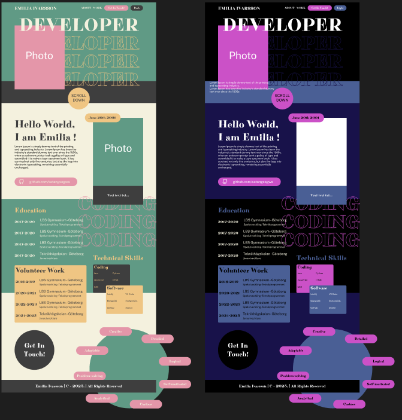
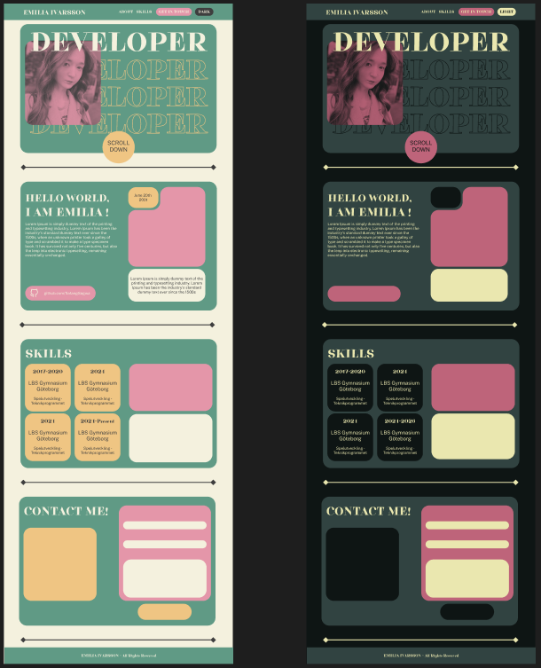
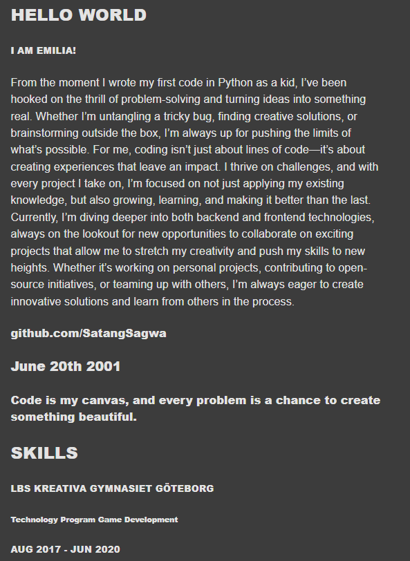

# Portfolio

## Design

Jag valde först att utgå ifrån en design jag hittade på Pinterest, skapade en Figma mockup och började direkt arbeta med HTML och CSS.

### Första Figma mockup:

Min idé var att göra att hjulet i botten snurrar och visar olika intressen, samt att skapa separata sidor för kontakt samt arbetserfarenhet. Jag ville att överlappande element skulle ge intrycket av att "det finns mer nedan" och driva användaren att fortsätta scrolla längre.
När jag kom till media queries så insåg jag att designen blev för komlicerad för syftet av denna uppgiften samt som första webbsida. Detta berodde på att det var mitt första projekt och att jag hade ej planerat strukturen överhuvudtaget eftersom jag var väldigt driven att börja skapa något. De överlappande elementen hade för det mesta absolute positioning, mycket hade fasta pixel-storlekar och det blev för tidskrävande i relation med deadline som närmade sig.

- Ett tag så trodde jag att min design såg bra ut, tills jag testade på min andra skärm och det såg riktigt dåligt ut. Då insåg jag att Windows hade satt "system zoom" till 125% som recommended (alltså gällde detta för alla program, även i chrome inspectorn). När jag bytt till 100%, så såg det inte längre likadant ut och jag ville inte lägga all tid på att få till CSS:en på nytt då jag inte hade börjat med JavaScript i detta skede. I framtiden skall jag vara extra noga med att kolla på olika enheter tidigare.

Jag bestämde mig för att byta idé och tog inspiration från "Bento"-trenden.
Bento innebär alltså att man delar upp designen i olika block och på så sätt styr användarens fokus, ett känt exempel är Apples produktpresentationer. Däremot behöll jag flera element som jag tyckte om ifrån den första designen, såsom färger, header och bilder.

Eftersom jag behövde göra om och fick ont om tid, så delade jag upp sektionerna i likadana flexboxar för att förenkla arbetet. Detta gjorde även designen enhetlig och tydlig. Även denna gången startade jag med HTML direkt, då jag tänkte att min Figma struktur skulle vara bra nog.

### PNG eller SVG?

I min första sektion har jag ett stycke dekorativ text. I min första design lade jag in dessa som fyra bilder men insåg det var svårt att få dem att skala fint och passa in på olika skärmstorlekar. Jag fick då tipset av Helena om att använda vektorgrafik istället, vilket lämpade sig bättre för mitt syfte.
Varje bokstav är en egen SVG, som är placerade i sektioner utefter vilken rad de tillhör. Detta möjliggör att jag kan ändra färg och skala samt visuellt skapa "radavstånd" samt "teckenavstånd". Tack vare att de även är sorterade i sektioner, möjliggör det att även lägga dem i en vertikal flexbox.

Typsnittet i vektorerna skiljer sig ifrån hemsidans rubriker, jag valde att istället använda ett liknande typsnitt då det var mer läsbart och jag ansåg att det såg bättre ut.

## Struktur

Jag har varje del i sin egen sektion med separerande dekorativa linjer (divider). Varje sektion har samma klass som anger form, storlek och färg. Det gör det enkelt att ändra alla sektioner enhetligt och säkerställa att de är lika. Alla utom den första sektionen är horisontella flexboxar som blir vertikala för att visas på smala enheter såsom vertikal telefon. Innehåller i var sida av flexboxarna skiljer sig däremot.
Jag har grupperat klasser som "round", "inner", "half-container", "button" osv. för att generalisera de egenskaper som återkommer på sidan.

Trots detta är jag långt ifrån nöjd med min struktur och anser att den är mycket rörig. CSSen hade med fördel kunnat delas upp i flera filer med exempelvis generella stilar samt efter sektion. Den är mycket lång och ej särkilt läsbar eller förståelig ifall man ej går utefter HTML strukturen och rakt av söker upp klassnamnen för att hitta i dokumentet.
Det hade varit bättre om jag gick igenom designen ordentligt och grupperat eller till och med bestämt klasser på alla element innan jag började.
Under detta arbetet har jag skapat klasserna utefter att jag skrivit CSSen och sett behov.

Textelementens typsnitt och storlekar definieras för sigsjälva för att hålla en god typografi och UI. Textstorleken varierar på olika skärmstorlekar. Däremot har jag ej definierat färgerna på detta sätt. Det bästa hade kanske varit att sätta klasser för färger.

## SEO

För sökoptimeringen har det tillags information som en beskrivande titel, meta description samt JSON-LD som anger information som kan vara betydande för en sökmotor. Det gäller exempel områden, plats och kontaktuppgifter. Alla element är semantiska, med header, main och footer. Bilderna har beskrivande alt-texter.

## Tillgänglighet och Prestanda

Mockup-färgerna uppnår inte kraven för WCAG 2.1 AA nivå gällande minimum kontrast, därav skiljer de sig från de faktiska färgerna som testats manuellt med WebAim's Contrast Checker.
Det går att ta sig genom hela sidan med enbart tangentsbordsnavigation, det finns en logisk struktur för headings, samt alla bilder har en kort men beskrivande alt-text. Det förekommer aria-attribut där jag ansåg att de var viktiga, såsom texten med datum som anger ålder, sektionen som håller git-knappen och aria-hidden för enbart dekorativa element. Det förekommer role-attribut och språk anges för att vara kompatibel med så många läsare som möjligt. Hemsidan klarar WebAim's WAVE test utan error.

- Chrome Reader view:

Jag lyckades ej testa på iOS, då det endast visade den första sektionen av sidan på mina enheter oavsett vilken sida jag testade. Däremot visas läsaren som tillgänglig och bör fungera utan iOS-problem.

## Responsivitet

Original CSS för: 2560x1440

#### Brytpunkter:

- Width: 2048px, 1366px, 1024px, 1000px, 500px
- Height: 1080px

#### Testad på enheter:

- Horisontell skärm - 2560x1440
- Horisontell skärm - 1920x1080
- Horisontell & vertikal Ipad Pro 5th Gen 12.9" - 2048x2732 (Liknar Chrome Inspectorns iPad Pro 1366x1024)
- Horisontell & vertikal Iphone 14 Pro - 2556x1179 (Liknar Chrome Inspectorns iPhone 12 Pro 844x390)
- Horisontell & vertikal Samsung S10 - 3040x1440 (Liknar iPhone 14 Pro)

## Funktionalitet

### Användar-feedback

Alla interaktiva element på sidan har en hover-effekt för att återge feedback till användaren.

### JavaScript

- Scroll-knappen samt navigeringsmenyn har funktioner där de scrollar till vardera sektion.
- Git-knappen öppnar ett nytt fönster med länken.
- Dark/Light knappen
  - Ändrar tema och sparar det i LocalStorage.
  - Temat laddas in när sidan öppnas/laddas om.
  - Temat anges genom att lägga till en klass på body som kallas "dark-theme". CSS-mallen har information om hur dark theme skall visas för specifika element.
  - "dark-theme" klassens förekomst anger även vilka källor bilderna skall använda.
- Ett kontaktformulär med validering och respons.
  - Det kontrollerar så att fält för namn och meddelande ej är tomma, samt att email adressen är av giltigt format.
  - Ifall det ej är giltigt, återges ett felmeddelande.
  - Annars töms formuläret och ett en tack-respons visas i några sekunder för att signalera att formuläret skickats (däremot, skickas det ingenstans egentligen.)

#### DOM-manipulation

I DOMContentLoaded ligger allt för konsistens samt för att säkerställa att knappar och bilder laddats in innan de försöker kommas åt och användas.
Bilder använder Lazy loading för optimering.

## Lärdomar och förbättringsområden

Jag är ändå lite tacksam att jag stött på många problem i detta projektet, det har gjort det tydligt vad jag skall förbättra.
För det första skall jag absolut planera bättre inför nästa gång, särskilt gällande klasser. Det är viktigt att identifiera vilka delar som har gemensamma attribut, då det underlättar arbetet med CSS enormt.
Jag skall se till att skapa en enklare design till en början och se till att allt kan skala som planerat.
Även HTML taggarna hade kunnat planerats ytterligare för att öka semantiken och lättare identifiera vart ARIA-attribut är lämpliga. Jag skall se till att färgernas kontrast är tillräckligt bra ifrån början samt bestämma typografi exakt (vart h1, h4 och p skall användas) redan i design-stadiet. Rent visuellt är jag nöjd med resultatet men hade hoppats på smidigare och snabbare utveckling.
I framtiden vill jag utöka sidan med mer information, roligare respons när meddelandet skickats (samt att faktiskt skicka meddelandet), och eventuellt att skala upp de interaktiva elementen litegrann vid hover. Skills-rutorna skulle kunna visa utökad information OnClick.

## Youtube Demonstration
https://www.youtube.com/watch?v=kWfrH7BuOWw

## Publicerad GitHub-page
https://satangsagwa.github.io/portfolio/start.html